# UsenetStreamer 🎬


**A Stremio addon that integrates your Usenet infrastructure for seamless content delivery**

UsenetStreamer bridges the gap between Prowlarr, NZBDav, and Stremio, enabling direct streaming of Usenet content without manual download management.

---

## 🌟 What Makes UsenetStreamer Special?

- **🚀 Direct Streaming** - Access content directly through Stremio
- **🎯 Smart Search** - Uses IMDb, TMDB, and TVDB IDs for accurate matching
- **🌍 Multi-Language Support** - Automatically groups results by your preferred language
- **📊 Quality Filtering** - Choose exactly which qualities you want to see (4K, 1080p, 720p, 480p)
- **🎨 Clean Interface** - 3-line format showing resolution, audio, source, and size information
- **🔒 Password Protection** - Optional authentication to secure your addon
- **⚡ WebDAV Integration** - Direct streaming from NZBDav without local storage requirements

---

## 🔄 How It Works

Here's the complete flow from your Usenet provider to Stremio:

```mermaid
graph LR
    A[🎬 Stremio] -->|Search Request| B[UsenetStreamer]
    B -->|Query with IMDb ID| C[🔍 Prowlarr]
    C -->|Search| D1[Indexer 1]
    C -->|Search| D2[Indexer 2]
    C -->|Search| D3[Indexer N...]
    D1 & D2 & D3 -->|NZB Results| C
    C -->|Aggregated Results| B
    B -->|User Clicks Stream| E[📦 NZBDav]
    E -->|Download via Usenet| F[🌐 Usenet Provider]
    F -->|File Data| E
    E -->|WebDAV Stream| B
    B -->|Video Stream| A
    
    style A fill:#8A5AAB,stroke:#fff,stroke-width:2px,color:#fff
    style B fill:#4A90E2,stroke:#fff,stroke-width:2px,color:#fff
    style C fill:#E67E22,stroke:#fff,stroke-width:2px,color:#fff
    style E fill:#27AE60,stroke:#fff,stroke-width:2px,color:#fff
    style F fill:#E74C3C,stroke:#fff,stroke-width:2px,color:#fff
```



### The Flow Explained

1. **Stremio Request** - User initiates a search in Stremio
2. **UsenetStreamer** - Receives the request with IMDb/TMDB/TVDB IDs
3. **Prowlarr** - Queries all configured Usenet indexers simultaneously
4. **Indexers** - Return matching NZB files from their databases
5. **UsenetStreamer** - Filters, sorts, and formats results by language and quality preferences
6. **User Selection** - User selects a result from the organized list
7. **NZBDav** - Retrieves the NZB content from the Usenet provider
8. **Streaming** - UsenetStreamer delivers the content to Stremio via WebDAV

---

## ✨ Key Features

### 🎯 Smart Content Discovery
- **ID-Based Search** - Uses IMDb, TMDB, and TVDB for precise matching
- **Fallback Text Search** - Falls back to title + year search if needed
- **Multi-Source Aggregation** - Combines results from all your indexers

### 🌍 Language Intelligence
- **3-Tier Grouping** - Streams organized by: Preferred Language → English → Other Languages
- **Visual Separators** - Clear dividers between language groups
- **MULTi Audio Detection** - Identifies releases with multiple audio tracks

### 📊 Quality Control
- **Flexible Filtering** - Choose specific qualities or combinations:
  - All Qualities
  - 4K/2160p only
  - 1080p only
  - 720p only
  - 480p only
  - 4K + 1080p
  - 1080p + 720p
  - 720p + 480p
- **Smart Sorting** - Sort by Quality First, Size First, or Date First
- **Audio Quality Detection** - Ranks from TrueHD Atmos down to AAC

### 🎨 Beautiful Stream Display
Each stream shows exactly what you need in 3 clean lines:
```
🎬 1080p • 🔊 DTS-HD MA 7.1
✨ HDR • 📀 BluRay REMUX • EPSILON
💾 42.3 GB • 📡 NZBgeek
```

### 🔒 Security & Privacy
- **Optional Password Protection** - Keep your addon private
- **Secure HTTPS Required** - Stremio enforces HTTPS for addons
- **Configuration UI** - Easy setup with a user-friendly form

---

## 📋 Prerequisites

Before you start, you'll need:

### Required Services

1. **Usenet Provider** ✅
   - Any Usenet service provider (Newshosting, UsenetServer, Eweka, etc.)
   - Active subscription with good retention

2. **Usenet Indexers** ✅
   - At least one NZB indexer (NZBgeek, NZBFinder, DrunkenSlug, etc.)
   - Free or paid accounts work fine

3. **Prowlarr** ✅
   - Installed and running
   - Your indexers added and configured
   - API key generated

4. **NZBDav** ✅
   - Installed and running
   - Connected to your Usenet provider
   - WebDAV server enabled
   - Categories configured (Movies, Tv)

5. **Public Domain with HTTPS** ✅
   - Required by Stremio for security
   - Options:
     - DuckDNS (free)
     - Your own domain
     - Cloudflare Tunnel
   - Valid SSL certificate (Let's Encrypt works great)

### System Requirements

- **Docker** (recommended) or **Node.js 20+**
- **Port 7000** available (or any port you prefer)
- **Reverse Proxy** for HTTPS (Nginx, Caddy, Traefik, etc.)

---

## 🚀 Quick Start Guide

### Step 1: Set Up Your Infrastructure

Make sure you have all prerequisites running:
- ✅ Prowlarr accessible at `http://your-server:9696`
- ✅ NZBDav accessible at `http://your-server:3000`
- ✅ Your domain pointing to your server
- ✅ HTTPS configured on your reverse proxy

### Step 2: Create Configuration File

Create a `.env` file with your settings:

```bash
# Prowlarr Configuration
PROWLARR_URL=http://your-server:9696
PROWLARR_API_KEY=your-prowlarr-api-key
PROWLARR_STRICT_ID_MATCH=false

# NZBDav Configuration
NZBDAV_URL=http://your-server:3000
NZBDAV_API_KEY=your-nzbdav-api-key
NZBDAV_WEBDAV_URL=http://your-server:3000
NZBDAV_WEBDAV_USER=your-webdav-username
NZBDAV_WEBDAV_PASS=your-webdav-password

# Addon Configuration
ADDON_BASE_URL=https://your-domain.com
MANIFEST_AUTH_PASSWORD=your-secret-password
```

### Step 3: Deploy with Docker

The easiest way to run UsenetStreamer:

```bash
docker run -d \
  --name usenetstreamer \
  -p 7000:7000 \
  --env-file /path/to/your/.env \
  ghcr.io/sanket9225/usenetstreamer:latest
```

**Or use Docker Compose:**

```yaml
version: '3.8'
services:
  usenetstreamer:
    image: ghcr.io/sanket9225/usenetstreamer:latest
    container_name: usenetstreamer
    ports:
      - "7000:7000"
    env_file:
      - .env
    restart: unless-stopped
```

Then run:
```bash
docker-compose up -d
```

### Step 4: Configure HTTPS with Reverse Proxy

**Example Nginx Configuration:**

```nginx
server {
    listen 443 ssl http2;
    server_name your-domain.com;

    ssl_certificate /etc/letsencrypt/live/your-domain.com/fullchain.pem;
    ssl_certificate_key /etc/letsencrypt/live/your-domain.com/privkey.pem;

    location / {
        proxy_pass http://localhost:7000;
        proxy_set_header Host $host;
        proxy_set_header X-Real-IP $remote_addr;
        proxy_set_header X-Forwarded-For $proxy_add_x_forwarded_for;
        proxy_set_header X-Forwarded-Proto $scheme;
        
        # Important for streaming
        proxy_buffering off;
        proxy_request_buffering off;
    }
}
```

**Example Caddy Configuration (Automatic HTTPS):**

```caddy
your-domain.com {
    reverse_proxy localhost:7000
}
```

### Step 5: Add to Stremio

1. **Open your browser** and go to `https://your-domain.com`
2. **Enter your password** (if you set `MANIFEST_AUTH_PASSWORD`)
3. **Configure preferences:**
   - Preferred Language
   - Sorting Method (Quality First, Size First, or Date First)
   - Quality Filter (which qualities to display)
   - Max Results (0 = unlimited)
4. **Click "Install"**
5. **Stremio opens automatically** and adds the addon

Done! 🎉

---

## ⚙️ Configuration Options

### Environment Variables

#### Prowlarr Settings
| Variable | Required | Default | Description |
|----------|----------|---------|-------------|
| `PROWLARR_URL` | ✅ Yes | - | Prowlarr base URL |
| `PROWLARR_API_KEY` | ✅ Yes | - | Prowlarr API key |
| `PROWLARR_STRICT_ID_MATCH` | ❌ No | `false` | Only use ID-based searches (faster but fewer results) |

#### NZBDav Settings
| Variable | Required | Default | Description |
|----------|----------|---------|-------------|
| `NZBDAV_URL` | ✅ Yes | - | NZBDav base URL |
| `NZBDAV_API_KEY` | ✅ Yes | - | NZBDav API key |
| `NZBDAV_WEBDAV_URL` | ✅ Yes | Same as `NZBDAV_URL` | WebDAV server URL |
| `NZBDAV_WEBDAV_USER` | ✅ Yes | - | WebDAV username |
| `NZBDAV_WEBDAV_PASS` | ✅ Yes | - | WebDAV password |
| `NZBDAV_CATEGORY_MOVIES` | ❌ No | `Movies` | NZBDav category for movies |
| `NZBDAV_CATEGORY_SERIES` | ❌ No | `Tv` | NZBDav category for TV shows |

#### Addon Settings
| Variable | Required | Default | Description |
|----------|----------|---------|-------------|
| `ADDON_BASE_URL` | ✅ Yes | - | Public HTTPS URL (e.g., `https://your-domain.com`) |
| `MANIFEST_AUTH_PASSWORD` | ❌ No | - | Password to protect your addon |
| `PORT` | ❌ No | `7000` | Internal port (change if port 7000 is taken) |

### User Preferences (Configured in Stremio)

- **Preferred Language** - Your preferred audio language for grouping
- **Sorting Method** - How to sort streams within each group
  - Quality First (default) - Best quality first
  - Size First - Largest files first
  - Date First - Newest releases first
- **Quality Filter** - Which qualities to show
  - All (default)
  - 4K/2160p only
  - 1080p only
  - 720p only
  - 480p only
  - 4K + 1080p
  - 1080p + 720p
  - 720p + 480p
- **Max Results** - Limit number of streams (0 = unlimited)

---

## 🎯 How to Use

### Accessing Content

1. **Open Stremio**
2. **Search for content using IMDb ID or title**
3. **Click on the title**
4. **Scroll down to "Streams"**
5. **Look for UsenetStreamer results** organized by language groups

### Stream Format Explained

```
🎬 1080p • 🔊 TrueHD Atmos 7.1          ← Resolution & Audio Quality
✨ HDR10+ • 📀 BluRay REMUX • EPSILON   ← HDR/Source/Release Group
💾 42.3 GB • 📡 NZBgeek                  ← Size & Indexer
```

- **Line 1** - Video resolution and audio codec with channels
- **Line 2** - HDR info, source (BluRay/WEB-DL/WEB), REMUX flag, and release group
- **Line 3** - File size and which indexer provided the result

### Language Groups

Results are divided into three groups with clear separators:

```
━━━━━ ⭐ Spanish (12) ━━━━━
[Your preferred language results appear first]

━━━━━ 🇬🇧 English (45) ━━━━━
[English results in the middle]

━━━━━ 🌍 Other Languages (8) ━━━━━
[Other language results at the end]
```

---

## 🔧 Advanced Configuration

### Setting Up DuckDNS (Free HTTPS Domain)

1. **Go to** [duckdns.org](https://www.duckdns.org)
2. **Sign in** with GitHub, Google, or Reddit
3. **Create a subdomain** (e.g., `myusenet.duckdns.org`)
4. **Update your IP** using their script or API
5. **Use certbot** to get a Let's Encrypt certificate:

```bash
sudo certbot certonly --standalone -d myusenet.duckdns.org
```

6. **Configure your reverse proxy** to use the certificate
7. **Set** `ADDON_BASE_URL=https://myusenet.duckdns.org` in `.env`

### Strict ID Matching Mode

Set `PROWLARR_STRICT_ID_MATCH=true` to:
- ✅ Only use IMDb/TMDB/TVDB ID searches
- ✅ Faster searches
- ✅ More accurate results
- ⚠️ Fewer total results (some indexers don't support ID searches)

Good for users with many high-quality indexers that support ID-based searching.

### Custom Categories in NZBDav

If your NZBDav uses different category names:

```bash
NZBDAV_CATEGORY_MOVIES=Films
NZBDAV_CATEGORY_SERIES=Television
```

### Building Your Own Docker Image

```bash
git clone https://github.com/sanket9225/usenetstreamer.git
cd usenetstreamer
docker build -t usenetstreamer:custom .
```

---

## 🎬 Supported Content Types

UsenetStreamer supports the following Stremio content types:

- ✅ **Movies** - Feature-length content
- ✅ **TV Series** - Episodic content organized by seasons
- ✅ **TV Shows** - General television content
- ✅ **Channels** - Channel-based content (if available in indexers)

---

## ⚡ Performance & Limitations

### What Works Well
- **Fast ID-based searches** - Results typically delivered in 2-5 seconds
- **Parallel indexer queries** - All indexers queried simultaneously
- **Efficient caching** - Reduces redundant NZBDav operations
- **Direct streaming** - Content begins delivery while NZBDav processes

### Current Limitations
- **⏱️ Initial buffering** - First 10-60 seconds while NZBDav processes the NZB
- **📦 NZBDav dependency** - Requires NZBDav to be running and properly configured
- **🌐 Usenet speed** - Delivery speed depends on your Usenet provider's performance
- **💾 NZBDav storage** - Retrieved content remains in NZBDav until manually removed
- **🔄 No resume capability** - If NZBDav fails, the delivery fails (failure video shown)

### Recommended Setup
- **Fast Usenet provider** - At least 50 Mbps for HD content, 100+ Mbps for 4K content
- **Quality indexers** - 2-3 reliable indexers provide optimal results
- **Adequate disk space** - NZBDav requires sufficient space for processing
- **Stable network** - Maintain stable internet connectivity for your server

---

## 🐛 Troubleshooting

### "No results found"
- ✅ Check Prowlarr is running and accessible
- ✅ Verify your indexers are enabled in Prowlarr
- ✅ Test Prowlarr search manually
- ✅ Check Prowlarr API key is correct

### "Content won't load / Buffering indefinitely"
- ✅ Check NZBDav is running and accessible
- ✅ Verify WebDAV credentials are correct
- ✅ Test WebDAV access manually
- ✅ Check NZBDav processing speed
- ✅ Ensure adequate disk space in NZBDav

### "Connection failed" / "Cannot reach addon"
- ✅ Verify ADDON_BASE_URL uses HTTPS (required by Stremio)
- ✅ Test your domain in a browser
- ✅ Check SSL certificate is valid
- ✅ Verify reverse proxy is running

### "Authentication failed"
- ✅ Check MANIFEST_AUTH_PASSWORD matches what you entered
- ✅ Try removing and re-adding the addon
- ✅ Verify .env file was loaded correctly

### Results showing "failure video"
- ✅ NZBDav failed to process - check NZBDav logs
- ✅ Could be incomplete NZB, failed extraction, or Usenet issues
- ✅ Try a different result for the same content

---

## 📚 Documentation

- **Stremio Addon SDK**: [stremio.github.io](https://github.com/Stremio/stremio-addon-sdk)
- **Prowlarr Docs**: [wiki.servarr.com/prowlarr](https://wiki.servarr.com/prowlarr)
- **NZBDav Project**: Check your NZBDav documentation

---

## 💡 Tips & Best Practices

### Getting Optimal Results
1. **Use multiple quality indexers** - 2-3 reliable indexers is better than 10 mediocre ones
2. **Enable ID search in indexers** - Improves search accuracy significantly
3. **Set preferred language** - Helps organize results more effectively
4. **Use quality filters** - Reduces clutter if you only want specific quality levels
5. **Monitor NZBDav** - Keep an eye on disk space and failed operations

### Optimizing Performance
1. **Use SSD for NZBDav** - Faster extraction and WebDAV access
2. **Increase Usenet connections** - More connections = faster processing
3. **Place NZBDav close to UsenetStreamer** - Reduces WebDAV latency
4. **Use strict ID matching** - If you have indexers with good ID support

### Security Recommendations
1. **Always use a password** - Set `MANIFEST_AUTH_PASSWORD`
2. **Use strong passwords** - For WebDAV and addon authentication
3. **Keep software updated** - Docker images, reverse proxy, SSL certificates
4. **Restrict network access** - Firewall rules to limit access to your services
5. **Use VPN for Usenet** - If required by your ISP or preferred for privacy

---

## ⚠️ Important Notice

UsenetStreamer is a technical integration tool designed to connect Prowlarr, NZBDav, and Stremio. Users are responsible for:

- Ensuring they have legal access to content through their Usenet subscriptions
- Complying with all applicable laws and regulations in their jurisdiction
- Respecting copyright and intellectual property rights
- Using the tool only for content they have the legal right to access

This software is provided as-is for integration and automation purposes. The developers assume no responsibility for how users choose to utilize this tool.

---

## 🤝 Contributing

UsenetStreamer is open source and welcomes contributions!

- Report bugs or request features: [GitHub Issues](https://github.com/sanket9225/usenetstreamer/issues)
- Submit improvements: Pull requests welcome
- Share your experience: Help improve this README

---

## 📄 License

ISC License - see LICENSE file for details

---

## 🙏 Credits

Built with:
- [Stremio Addon SDK](https://github.com/Stremio/stremio-addon-sdk)
- [video-filename-parser](https://github.com/scttcper/video-filename-parser)
- [webdav](https://github.com/perry-mitchell/webdav-client)
- [axios](https://axios-http.com/)
- [Express](https://expressjs.com/)

Special thanks to:
- The Stremio team for the amazing platform
- Prowlarr developers for the powerful indexer manager
- NZBDav developers for WebDAV streaming support
- All Usenet indexers keeping the content flowing

---

## ⭐ Show Your Support

If UsenetStreamer makes your Stremio experience better, consider:
- Starring the repository ⭐
- Sharing with others who might benefit
- Contributing improvements or documentation
- Supporting the Usenet ecosystem

---

**Made with ❤️ for the Stremio and Usenet integration communities**

*Empowering seamless infrastructure integration! 🔧*